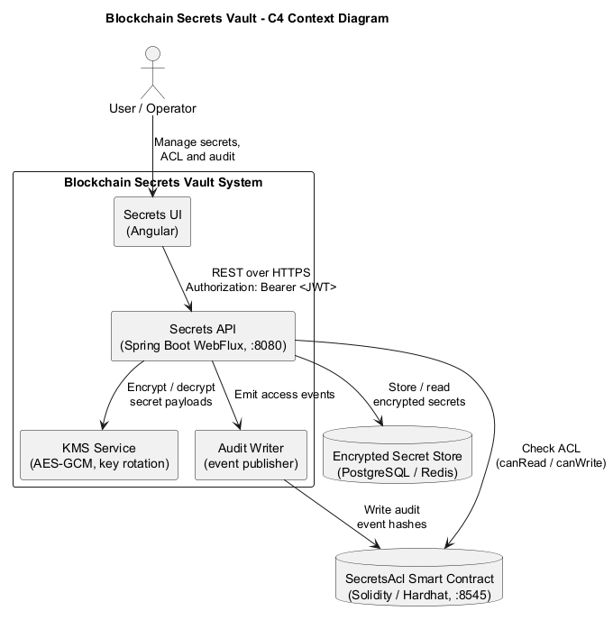

# Blockchain Secrets Vault

Blockchain Secrets Vault is a distributed secrets storage that uses a blockchain
as an immutable ACL and audit layer, while encrypted secrets are kept off-chain.

The project demonstrates:

- Zero-trust architecture
- Blockchain-based access control
- AES-GCM encryption
- Key rotation
- On-chain access auditing
- Microservice architecture (Senior/Architect level)

## Architecture



Full diagram: [docs/architecture.md](docs/architecture.md)

Secrets API contract: [docs/api/secrets-api.md](docs/api/secrets-api.md)

### Components

- **Secrets API** - CRUD over secrets and API contract for the MVP. KMS
  encryption/decryption and blockchain ACL checks are planned follow-up work
  (#8, #9).
- **KMS Service** - master key generation, AES-GCM encryption, key rotation.
- **Blockchain ACL Contract** - stores ACL (who can read/write), revocations, and
  access audit.
- **Audit Writer** - writes hashes of access events to the blockchain.
- **Secrets UI** - secrets management, ACL management, audit viewing.

## Tech Stack

### Backend
- Java 25+, Spring Boot, Spring WebFlux, Spring Security
- Maven multi-module
- Web3j
- AES-GCM, RSA/ECDSA
- PostgreSQL / Redis

### Blockchain
- Hardhat, Solidity
- `SecretsAcl.sol` contract

### Frontend
- Dependency-free HTML, CSS, and JavaScript UI MVP
- Node.js built-in test runner with coverage gates

### Infrastructure
- Docker Compose, optional Kubernetes

## Repository Layout

```text
blockchain-secrets-vault/
├─ backend/      # Spring Boot multi-module services
├─ blockchain/   # Hardhat project and Solidity contracts
├─ frontend/     # Secrets management UI
├─ deploy/       # docker-compose and environment configuration
├─ docs/         # architecture and API documentation
└─ ROADMAP.md
```

## Frontend

Open `frontend/index.html` in a browser to use the secrets management UI against
the Secrets API at `/api/v1/secrets`.

Run frontend tests and coverage checks:

```bash
cd frontend
npm test
```

## Roadmap

See [ROADMAP.md](./ROADMAP.md) and the
[project board](https://github.com/users/igorsatsyuk/projects/4).

## License

MIT
