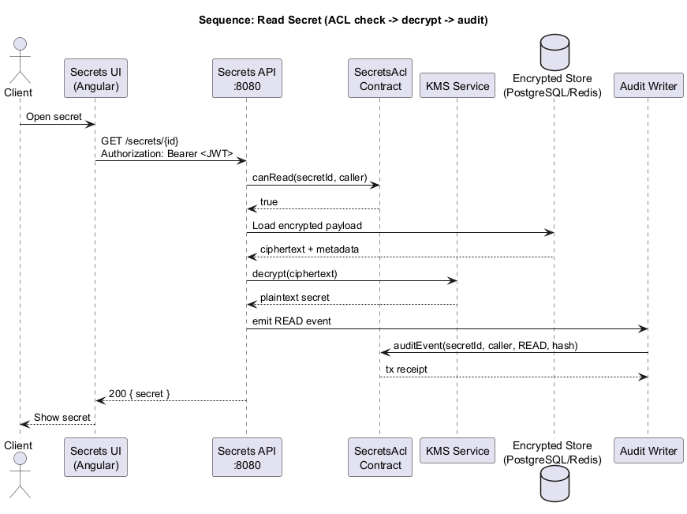
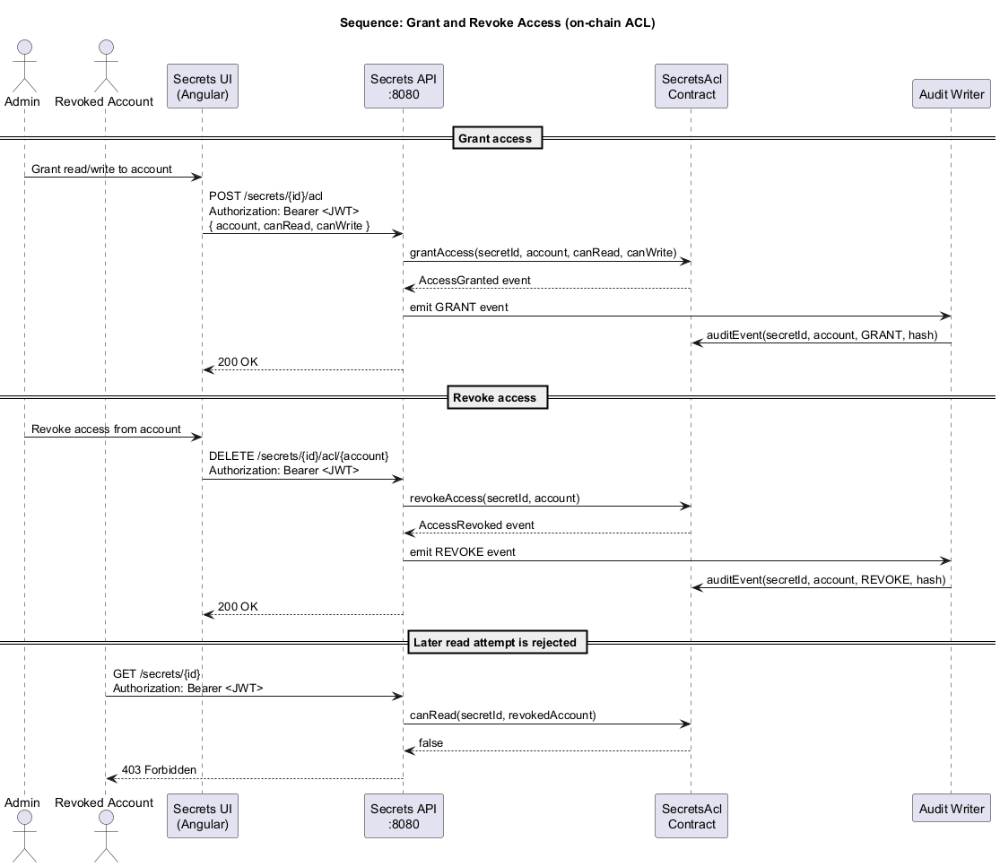

# Architecture

Diagrams are stored in `docs/diagrams/` as PlantUML source and exported PNG files.

## C4 Context

Source: `docs/diagrams/c4-context.puml`

## Sequence: Read secret (ACL check -> decrypt -> audit)

Source: `docs/diagrams/sequence-read-secret.puml`

## Sequence: Grant and revoke access (on-chain ACL)

Source: `docs/diagrams/sequence-grant-revoke.puml`

## Envelope Encryption

Secrets API stores encrypted payloads off-chain using envelope encryption. KMS
generates a fresh data encryption key (DEK) for each payload, encrypts the
payload with AES-GCM, and wraps the DEK with the active key encryption key
(KEK). Stored metadata includes the KEK id/version plus nonce and authentication
tag material for both the payload and wrapped DEK.

Key rotation creates a new active KEK version. Existing envelope-encrypted
secrets are rotated by re-wrapping their DEK with the new KEK; the encrypted
secret payload is not decrypted or rewritten. Legacy payloads without wrapped
DEK metadata are still readable and are migrated to envelope encryption during
the next rotation.
